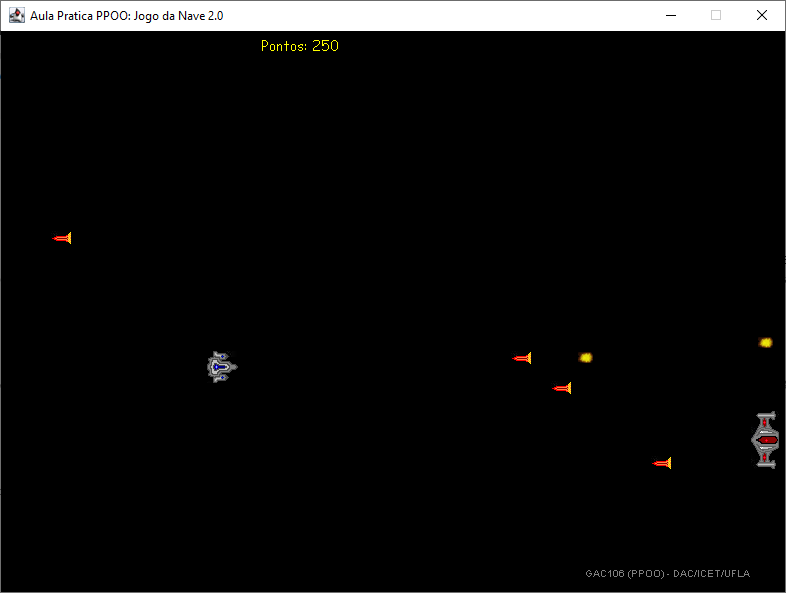

# Nave 2.0

Implementação de um jogo de Nave simples para primeiro contato com a linguagem Java e conceitos de Orientação a Objetos.

Nesta versão o código Java é completo, incluindo os modificadores de visibilidade para respeitar o encapsulamento. Mas conceitos como herança não são utilizados.

## Para iniciar o jogo

Em um terminal compile o código do programa com o seguinte comando:

```bash
javac JogoNave.java
```

Em seguida, execute o jogo com o comando:

```bash
java JogoNave
```



## Como jogar

A dinâmica do jogo é simples.

- Você controla a nave da esquerda usando as setas do teclado.
- E pode atirar digitando a tecla `Ctrl`.
- A tecla `ENTER` pausa o jogo.
- O inimigo se move aleatoriamente na vertical e também atira aleatoriamente.
- Seu objetivo é destruir o maior número de inimigos possível sem ser morto.
- Você  ganha 50 pontos a cada inimigo morto.
- Se você morrer, você pode reiniciar o jogo apertando `F2` no teclado.

Jogue e veja quantos pontos consegue alcançar!

## Sugestões de Exercícios

### 1. Exibir um texto ao lado da nave

A classe Nave possui um método chamado getTextoExibicao.
- Repare que atualmente ele retorna uma String vazia.
- Coloque algum texto na String, compile o programa, e inicie o jogo pra ver o que acontece.

### 2. Exibir o nome do jogador ao lado da nave

Você viu que o texto aparece ao lado da Nave.
- Vamos aproveitar isso para criar um atributo novo na classe Nave para guardar o nome do jogador.
- Crie então um atributo do tipo String chamado nomeJogador.
- Crie um método chamado alterarNome, que recebe um novo nome por parâmetro e atualiza o atributo nomeJogador.
- Por fim, altere o método getTextoExibicao para que ele exiba o valor do atributo nomeJogador.
- Na classe TesteJogo, chame o método alterarNome do objeto da classe Nave antes de executar o loopDeJogo.

### 3. Tornando a nave mais forte

A Nave atualmente é muito fraca, certo?
- Com apenas um tiro ela morre!
- E que tal se ela tivesse escudos?
- Assim quando ela tomar um tiro ela perde um escudo, mas só morre se não tiver mais nenhum.

Altere a classe Nave de forma que ela passe a ter escudos.
- Crie um atributo numeroDeEscudos.
- Avalie em qual método ele deve ser inicializado e faça com que a nave sempre comece o jogo com três escudos.
- Qual parte do código deve ser alterada para que a nave não morra com um único tiro, mas sim perca os escudos primeiro?
- Faça a alteração no método necessário.

Jogue e teste os escudos da Nave.

### 4. Melhorando a usabilidade

Bom, foi bacana nossa nave ter ficado mais forte
- Mas quem está jogando não sabe quantos escudos a nave tem!

Altere o método getTextoExibicao para exibir o número de escudos.
- Exiba, na frente do nome do jogador, um asterisco para cada escudo que a nave possua.

Jogue novamente e teste a alteração.
- Agora ficou bem melhor!

### 5. Deixando as coisas menos previsíveis

Vamos deixar a dificuldade do jogo um pouco mais imprevisível
- Crie um método na classe Nave chamado gerarEscudos.
- Nesse método faça com que o atributo numeroDeEscudos receba um valor aleatório entre 0 e 5.
- Altere então a inicialização do atributo numeroDeEscudos, retirando o código atual que inicializa com 3 e chamando o método gerarEscudos.

Jogue o jogo e reinicie-o algumas vezes ao morrer.
- Deu certo, conforme esperado?
- Senão o que ficou faltando?

Dicas:
- Estude o uso do objeto da classe Random que é usado na classe Inimigo.
- Repare em todos os lugares que o atributo random é usado e veja o que precisará ser feito igual na classe Nave.

### 6. Deixando o jogo mais difícil

A gente facilitou as coisas colocando os escudos.
- Agora vamos dificultar um pouco.

Vamos fazer com que cada tiro do inimigo possa ter uma velocidade diferente.
- A classe tiro sabe quando um tiro é do inimigo ou da nave.
- Altere então o construtor da classe (aquele método que tem o nome igual ao da classe)
- De forma que a velocidade do tiro do inimigo (apenas dele) possa ser de 1 a 4 vezes a velocidade normal (sorteado aleatoriamente).

Jogue o jogo e teste a alteração
- E aí, ficou mais divertido?
